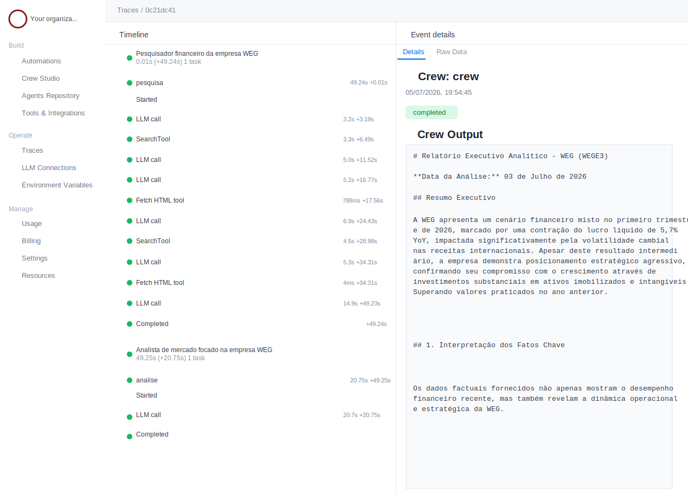

# 🚀 FinantialResearcherBruno Crew

Projeto de estudo com [crewAI](https://crewai.com) para montar um sistema multiagente de pesquisa financeira. A ideia aqui é manter o setup simples, local quando possível, e fácil de retomar depois.

## 🚀 Início rápido

1. Entrar na pasta do subprojeto:

```bash
cd brunoconterato/3_crew/coursework/finantial_researcher_bruno
```

2. Criar/atualizar as dependências:

```bash
uv sync
```

3. Rodar o crew com `uv`:

```bash
uv run finantial_researcher_bruno
```

Se quiser usar o Ollama local, os comandos mais comuns são:

```bash
docker start ollama-local
```

ou, para recriar o container e atualizar o modelo:

```bash
../script/run_ollama_docker.sh
```

## 🛠️ O que este projeto precisa

Por padrão, este projeto não precisa de um container Docker separado para DuckDuckGo. A busca na web é feita com `WebsiteSearchTool`, e o único serviço local que precisa estar disponível para o crew é o Ollama.

Se você quiser o stack de busca totalmente local, leia:

- [Local Web Research](LOCAL_WEB_RESEARCH.md)

## 🛠️ Instalação

Garanta que você tenha Python >= 3.10 e < 3.13 instalado no sistema. Este projeto usa [UV](https://docs.astral.sh/uv/) para gerenciamento de dependências e execução.

Se ainda não tiver o `uv`, instale com:

```bash
pip install uv
```

Depois instale as dependências do projeto:

```bash
uv sync
```

## 🎨 Personalização

Adicione as credenciais do modelo no arquivo `.env`.

- Para OpenAI, defina `OPENAI_API_KEY`
- Para Ollama local, defina `MODEL=ollama/gemma4:e2b`, `EMBEDDINGS_OLLAMA_MODEL_NAME=nomic-embed-text` e `OLLAMA_API_BASE=http://localhost:11434`
- Se você usar outro modelo do Ollama, mantenha o prefixo `ollama/` em `MODEL`
- Em uma máquina nova, copie `.env.example` para `.env` e ajuste os valores necessários
- O campo `MODEL` precisa incluir o prefixo do provedor, por exemplo `ollama/gemma4:e2b`, e não apenas `gemma4:e2b`
- `OLLAMA_API_BASE` precisa apontar para um servidor Ollama acessível, normalmente `http://localhost:11434`
- `EMBEDDINGS_OLLAMA_URL` é opcional; quando não for informado, o código usa `OLLAMA_API_BASE/api/embeddings`

Arquivos principais para adaptação:

- `src/finantial_researcher_bruno/config/agents.yaml` para definir os agentes
- `src/finantial_researcher_bruno/config/tasks.yaml` para definir as tarefas
- `src/finantial_researcher_bruno/crew.py` para adicionar lógica, ferramentas e argumentos específicos
- `src/finantial_researcher_bruno/main.py` para incluir entradas personalizadas para agentes e tarefas

## 🧭 Como orientar o uso de tools

Quando você quiser que um agente use uma tool de forma mais direta, escreva a instrução no `goal`, no `description` da task e no `expected_output`.

Exemplo prático para este projeto:

- primeiro faça a busca;
- depois, para cada página que parecer relevante, chame `fetch_html_tool`;
- extraia fatos, números e trechos úteis dessa página antes de seguir para a próxima;
- registre na resposta quais páginas foram lidas com a tool.

Esse tipo de orientação funciona para qualquer tool: diga quando usar, em qual ordem, o que extrair e o que fazer se a tool falhar.

## ▶️ Como rodar

Depois de instalar as dependências, execute o crew a partir da raiz do subprojeto com:

```bash
uv run finantial_researcher_bruno
```

Esse comando inicializa o `finantial_researcher_bruno Crew`, monta os agentes e executa as tarefas definidas na configuração.

No exemplo padrão, o fluxo cria um arquivo `report.md` na raiz com o resultado de uma pesquisa sobre LLMs.

Se você estiver usando Ollama local e o shell não tiver diretórios graváveis padrão para cache/dados, este comando ajuda:

```bash
UV_CACHE_DIR=/tmp/uv-cache XDG_DATA_HOME=/tmp/crewai-data CREWAI_DISABLE_TELEMETRY=true uv run --no-sync finantial_researcher_bruno
```

Se usar essa forma, deixe as mesmas variáveis de ambiente disponíveis também quando iniciar o container do Ollama, para ambos apontarem para o mesmo endereço local.

## 📦 Gerenciamento de dependências com uv

Adicionar um pacote ao projeto:

```bash
uv add nome-do-pacote
```

Exemplo:

```bash
uv add ddgs trafilatura
```

Adicionar uma dependência de desenvolvimento:

```bash
uv add --dev pytest
```

Sincronizar o ambiente com o pyproject.toml e o lockfile:

```bash
uv sync
```

Executar um comando dentro do ambiente:

```bash
uv run <comando>
```

Executar sem sincronizar novamente:

```bash
uv run --no-sync <comando>
```

O uv add:

- adiciona a dependência ao pyproject.toml;
- atualiza o lockfile;
- instala o pacote no ambiente do projeto.

Referência: [uv CLI Reference](https://docs.astral.sh/uv/reference/cli/).

## 🛠️ Recuperação rápida

Se algo parar de funcionar em uma máquina nova, siga esta ordem:

1. Confirme que o Docker está rodando.
2. Suba ou recrie o Ollama com `docker start ollama-local` ou `../script/run_ollama_docker.sh`.
3. Confirme que `OLLAMA_API_BASE` ainda aponta para o host e a porta corretos.
4. Rode `uv sync` novamente para reinstalar dependências faltantes.
5. Execute o crew outra vez com `uv run finantial_researcher_bruno`.

## 🐞 Debug Com CrewAI

Para debugar de forma mais eficiente:

1. Comece pelo menor passo reproduzível, por exemplo um import isolado ou uma chamada curta com `uv run --no-sync`.
2. Mantenha `verbose=True` nos agentes e tarefas enquanto estiver investigando.
3. Leia os `print()` e logs no terminal de onde você executou o comando. Se você rodou `uv run ...` no terminal integrado do VSCode, a saída aparece ali mesmo.
4. Se o traceback ficar curto demais, procure wrappers como `raise Exception(...)` no `main.py`; eles escondem a causa original e deixam o debug pior.
5. Use `uv run --no-sync finantial_researcher_bruno` para repetir o erro sem re-sincronizar o ambiente a cada tentativa.
6. Use o fluxo de teste/replay do CrewAI para reproduzir uma execução específica.
7. Consulte as páginas oficiais do CrewAI:
   - [CrewAI Documentation](https://docs.crewai.com/)
   - [CLI](https://docs.crewai.com/v1.15.1/en/concepts/cli.md)
   - [Testing](https://docs.crewai.com/v1.15.1/en/concepts/testing.md)
   - [Traces](https://docs.crewai.com/v1.15.1/en/enterprise/features/traces.md)
8. Quando o erro vier do LLM ou do servidor local, confirme primeiro a conexão com o backend antes de mexer na lógica do agente.

### Tracing

O tracing do CrewAI ajuda a inspecionar a execução do crew sem depender só do `print()`:

- mostra decisões do agente, timeline das tasks, uso de tools e chamadas ao LLM;
- pode ser habilitado por crew/flow com `tracing=True`;
- também pode ser ligado globalmente com `CREWAI_TRACING_ENABLED=true`;
- para ver os traces no dashboard, use sua conta do CrewAI AMP.

Fluxo de login que funcionou neste projeto:

1. Abra `https://app.crewai.com` no navegador e faça login manualmente.
2. No terminal do subprojeto, rode `uv run crewai login`.
3. O CLI deve abrir uma página no navegador com um código de confirmação.
4. Confira se o código mostrado no navegador bate com o código do terminal.
5. Autorize o acesso.
6. Confirme que o terminal terminou com algo parecido com:

```text
You are now authenticated to the tool repository for organization '...'
Welcome to CrewAI AMP
```

Isso é útil quando você quer entender por que um agente escolheu uma tool, onde ele parou ou quanto tempo gastou em cada etapa.

#### Ativação rápida

1. Garanta que `CREWAI_TRACING_ENABLED=true` esteja no `.env`.
2. Garanta que o `Crew` esteja com `tracing=True`.
3. Faça login em `https://app.crewai.com` pelo navegador.
4. Rode `uv run crewai login` e autorize o código no navegador.
5. Execute o crew com `uv run finantial_researcher_bruno`.

Ao final da execução, o terminal deve mostrar um bloco parecido com este:

```text
╭───────────────────────────────────────────────── Trace Batch Finalization ─────────────────────────────────────────────────╮
│ ✅ Trace batch finalized with session ID: 0c21dc41-8e8f-42bb-a0d7-edc499509686                                             │
│                                                                                                                            │
│ 🔗 View here: https://app.crewai.com/crewai_plus/trace_batches/0c21dc41-8e8f-42bb-a0d7-edc499509686                        │
╰────────────────────────────────────────────────────────────────────────────────────────────────────────────────────────────╯
```

Clique no link `View here` para abrir o trace no navegador. A tela abre na timeline da execução e ajuda a fazer o debug passo a passo.

#### Como ler a timeline



Na tela de trace:

- a coluna da esquerda mostra a ordem dos eventos;
- cada agente aparece como um bloco principal, com duração total e quantidade de tasks;
- cada task aparece abaixo do agente, por exemplo `pesquisa` ou `analise`;
- eventos `LLM call` mostram quando o agente chamou o modelo;
- eventos de tool, como `SearchTool` e `Fetch HTML tool`, mostram quando uma ferramenta foi usada;
- o tempo ao lado de cada evento ajuda a encontrar gargalos;
- clique em um evento para ver os detalhes no painel da direita;
- em `Event details`, use `Details` para ler o resumo amigável e `Raw Data` para ver os dados completos;
- em eventos concluídos, o painel mostra o output gerado, como o relatório final do crew.

Para debugar rápido, procure primeiro onde a timeline parou, qual evento demorou mais e qual input/output apareceu na tool ou chamada de LLM.

### Debug No VSCode

Para debugar no VSCode, use `launch.json` apontando para o módulo do projeto:

```json
{
  "version": "0.2.0",
  "configurations": [
    {
      "name": "Debug finantial_researcher_bruno",
      "type": "python",
      "request": "launch",
      "module": "finantial_researcher_bruno",
      "cwd": "${workspaceFolder}/brunoconterato/3_crew/coursework/finantial_researcher_bruno",
      "console": "integratedTerminal",
      "justMyCode": false
    }
  ]
}
```

Passos rápidos:

1. Abra a pasta raiz do workspace no VSCode.
2. Crie o breakpoint no `main.py`, `crew.py` ou na tool que você quer observar.
3. Selecione a configuração `Debug finantial_researcher_bruno`.
4. Inicie com `F5`.
5. Veja os `print()` e os logs no terminal integrado enquanto o debugger estiver parado no breakpoint.

#### Troubleshoot do 401

Se o tracing não subir e o terminal mostrar mensagens parecidas com estas, o problema costuma ser autenticação/organização no AMP:

```text
Trace batch initialization returned status 401. Continuing without tracing.
```

ou:

```text
Authentication failed. Verify if the currently active organization can access the tool repository
[401 error - Bad credentials - User not found]
```

Checklist rápido:

1. Abra `https://app.crewai.com` no navegador e faça login manualmente.
2. Rode `uv run crewai login` de novo no terminal do subprojeto.
3. Confira se o código do navegador bate com o código exibido no terminal.
4. Autorize o acesso no navegador.
5. Confirme que o login termina com `Success!` tanto no AMP quanto no Tool Repository.
6. Verifique se o terminal mostra um `organization '...` ativo.
7. Rode o crew outra vez com tracing ligado.

## 🧠 Entendendo o crew

O `finantial_researcher_bruno Crew` é composto por múltiplos agentes de IA, cada um com papéis, metas e ferramentas próprias. Esses agentes colaboram em um conjunto de tarefas definido em `config/tasks.yaml`, usando suas habilidades combinadas para atingir objetivos mais complexos. O arquivo `config/agents.yaml` descreve as capacidades e configurações de cada agente.

## 🆘 Suporte

Para suporte, dúvidas ou feedback sobre o FinantialResearcherBruno Crew ou sobre o crewAI:

- Consulte a [documentação](https://docs.crewai.com)
- Acesse o [repositório no GitHub](https://github.com/joaomdmoura/crewai)
- Entre no [Discord](https://discord.com/invite/X4JWnZnxPb)
- Converse com a [documentação interativa](https://chatg.pt/DWjSBZn)

Vamos criar coisas boas juntos com a simplicidade e a potência do crewAI.
