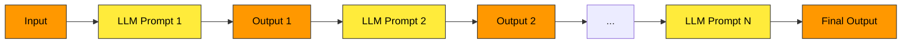
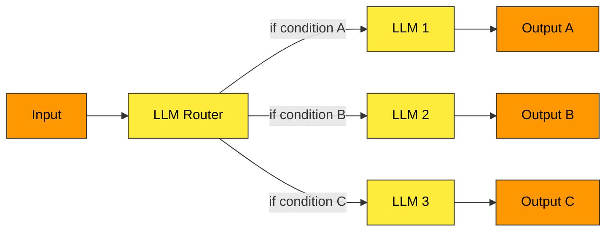
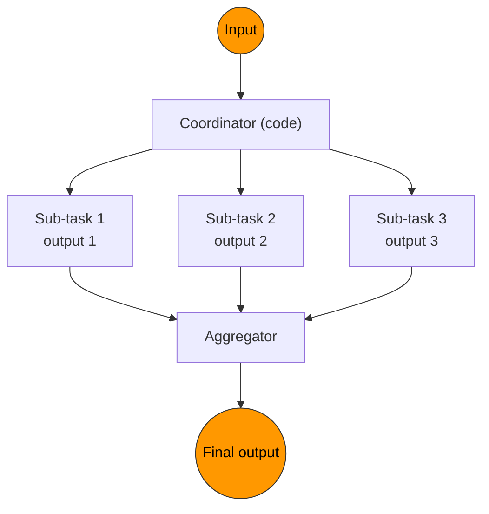
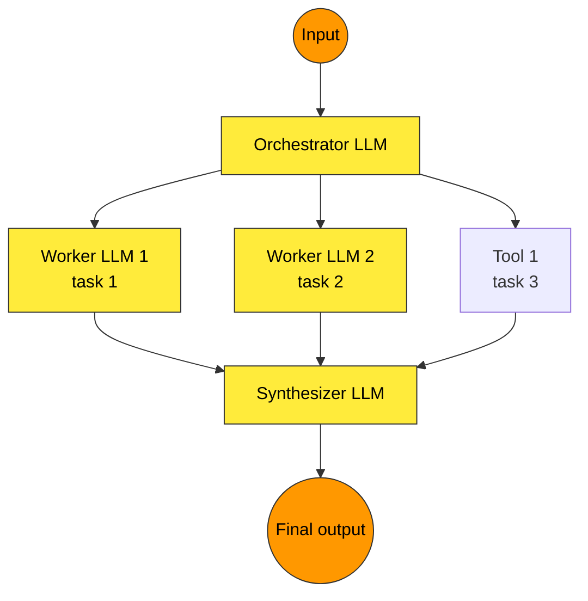
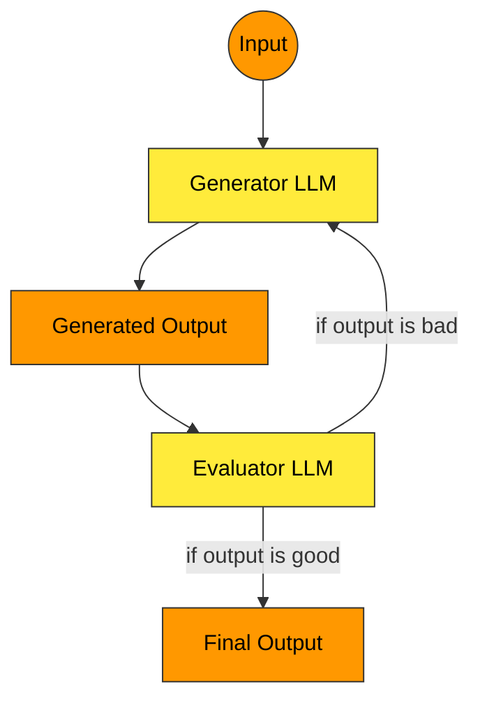
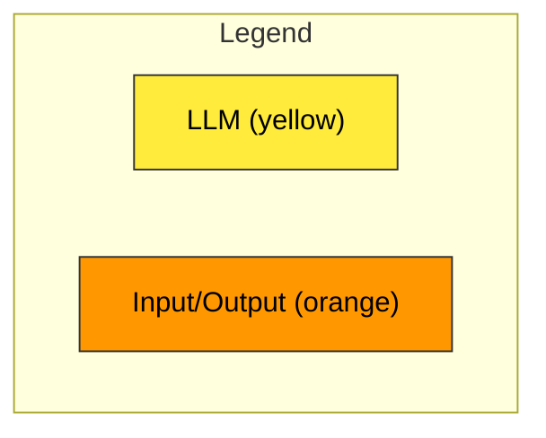
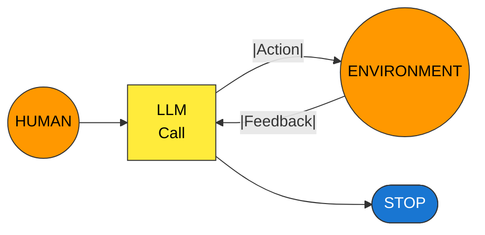

# Week 1 - Day 2 - Theory Notes

## Agentic Systems

Anthropic distinguishes between two types of AI systems: **Workflows** and **Agents**.

- **Workflows** are systems where LLMs and tools are orchestrated through predefined code paths.
- **Agents** are systems where LLMs dinamically direct their own processes and tool usage, maintaining control over how they accomplish tasks.

### Comments and examples

- **🔁 Workflows**: An example of a workflow is a customer support chatbot that follows a fixed script to answer common questions. The LLM processes user input and selects from a set of predefined responses or actions based on the input, without deviating from the established flow.
- **🤖 Agents**: An example of an agent is a personal assistant AI that can autonomously decide which tools to use (like calendar management, email drafting, or web searching) based on the user's requests. The agent evaluates the context and determines the best course of action to fulfill the user's needs, adapting its strategy as necessary.

## 🔁 Workflow design patterns

### 1. Prompt Chaining Pattern

Link multiple LLM prompts together, passing the output of one as the input to the next.

Example schema:

### 2. Routing Pattern

Direct an input into different paths based on its content.

Example schema:

### 3. Parallelization Pattern

Breaking down a task into multiple sub-tasks that can be processed simultaneously.

### 4. Orchestrator-Worker Pattern

Complex tasks are broken down dinamically and combined.

### 5. Evaluator-Optimizer Pattern

LLM output is validated by another.

## Legend

## By contrast, Agents

1. Open-ended
   - Workflows have a predefined path; agents can adapt and change their approach.
2. Feedback loops
   - Agents can evaluate their own performance and adjust strategies.
3. No fixed paths
   - Agents decide which tools to use and when, rather than following a set sequence.

## Risks of Agents Frameworks

- Unpredictable path
- Unpredicted outputs
- Unpredictable costs

### Mitigation Strategies

- Monitoring
  - Specially when multi-agent systems are used
  - OpenAi trace, LangGraph, LangSmith etc.
- Guardrails
  - Limit actions and outputs
  - "Guardrail ensure your agents behave safely, consistently, and within your intended boundaries."

## Summary

- Workflows are suitable for well-defined tasks with clear steps, while agents excel in dynamic environments requiring adaptability and decision-making.
- The agentic paradigm is better when compared with the Evaluator-Optimizer Pattern because it allows for more flexibility and adaptability in complex tasks. It's more fluid and can handle unexpected situations better than rigid workflows.
